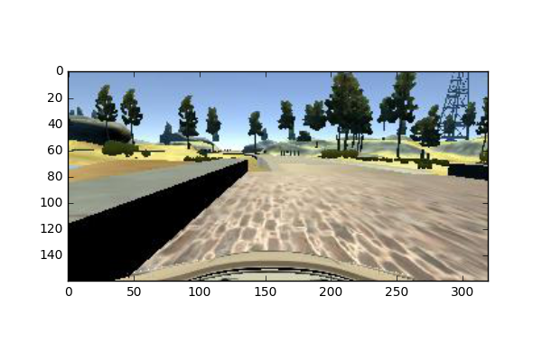
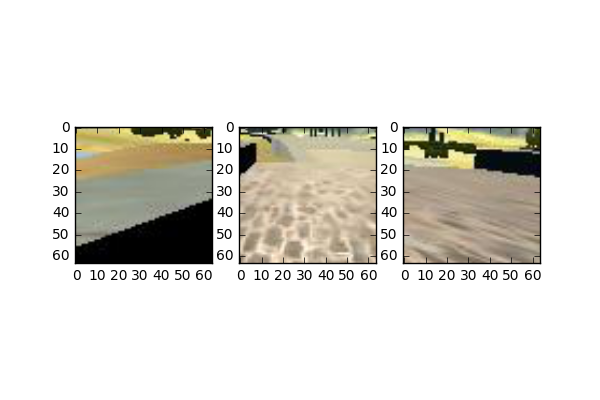

# Behavioral-Cloning
> Please refer to: Self-Driving Car Engineer Nanodegree - Udacity, [Term 1 - Project 3](https://github.com/udacity/CarND-Behavioral-Cloning-P3)

### Overview
This project uses a deep convolutional neural networks to clone driving behavior. 
he model will output a steering angle to an autonomous vehicle after training, validating and testing a CNN model using Keras.   

### Dependencies
The code requires **Python 3.5**. Please refer to the [project website](https://github.com/udacity/CarND-Behavioral-Cloning-P3) for implementation details. 

### Data collection 
Inspired by the [Paul Heraty's approach](https://github.com/PaulHeraty/BehaviouralCloning), I save every time the parameters of the model and running from there with fresh data:
* Data collection tool: mouse 
* Collected dataset of 42,000 images

### Comments
The model I present here selects three picture-in-picture squares of 64x64 pixels in the middle-lower part of the image; one in the center and the others in the extreme left and right of the image. 

As an example, the code first get the whole image: 

and then it use as input three PiPs:

The full description of the approach is explained in a separate [file](REFLECTIONS.md). 

* the test accuracy: 85%
