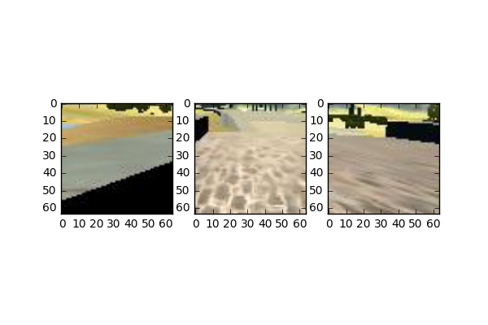

# Behavioral Cloning Project  

  
  
### Designing the model

To approach the tasks of Project 3, I started trying to replicate the NVIDIA model as described in this [paper](http://images.nvidia.com/content/tegra/automotive/images/2016/solutions/pdf/end-to-end-dl-using-px.pdf). By taking images from the front-facing camera of the car, the authors show the use of a convolutional neural network (CNN) to estimate the steering angle. Briefly, the model normalizes inputs (pixels) and applies 7 convolutional layers before flattening; then it uses these results as input for 3 more fully connected layers.   

In taking this approach, I first examined the initial dataset and I found it well balanced in positive and negative steering angles, but also with many zeroes. Being zeroes the values taken when relaxing the mouse, I supposed that most of them often were simply "noise" of the true steering angle. 
Moreover, the upper part of images contains mostly sky, while in the remaining one there many other elements that should not lead to a particular steering angle. Looking for a general model, I supposed that - racing in a relatively short circuit - this factor could lead to overfitting. 

So, when feeding my cloned-Nvidia model, I decided to try both the full image and its lower side and letting and removing some/all zeroes. I tried by using both color and gray images, and even the three single color channels alone. I suppose the Nvidia model was too complex to train with the given dataset only. 

Therefore, I decided to try a different approach because of the poor results I was obtaining.

>The model I present here selects three picture-in-picture squares of 64x64 pixels in the middle-lower part of the image; one in the center and the others aside at the same latitude (in the extreme left and right of the image). This was my personal behavioural-cloning approach: when driving a car, I look in front, keeping an eye to the borders of the road.

As an example, the code first gets the whole image: 


and then it uses - as input - three PiPs:




### Details of the model

Given a set of three picture-in-picture squares (a 64x64 pixels input for each of them), the model follows the architecture below visualized:

   
   ** -------------------    -------------------     ------------------

```sh
   $  InputLayer_Left        InputLayer_Center       InputLayer_Right 
     (None, 64, 64, 3)       (None, 64, 64, 3)       (None, 64, 64, 3)

   $  Normalization [-1,1]   Normalization [-1,1]    Normalization [-1,1]
   
   $  Convolution 2D         Convolution 2D          Convolution 2D
      border 'valid'         border 'valid'          border 'valid'
      subsample (2,2)        subsample (2,2)         subsample (2,2)
      activation relu        activation relu         activation relu
     (None, 30, 30, 32)     (None, 30, 30, 32)      (None, 30, 30, 32)
   
   $  Convolution 2D         Convolution 2D          Convolution 2D
      border 'valid'         border 'valid'          border 'valid'
      subsample (2,2)        subsample (2,2)         subsample (2,2)
      activation relu        activation relu         activation relu
     (None, 13, 13, 32)     (None, 13, 13, 32)      (None, 13, 13, 32)
   
   $  Convolution 2D         Convolution 2D          Convolution 2D
      border 'valid'         border 'valid'          border 'valid'
      subsample (2,2)        subsample (2,2)         subsample (2,2)
      activation relu        activation relu         activation relu
     (None, 5, 5, 32)       (None, 5, 5, 32)        (None, 5, 5, 32)  
   
   $  Drop out  (0.50)       Drop out  (0.50)        Drop out  (0.50)  

   $  Dense layer (16)       Dense layer (16)        Dense layer (16)  
     (None, 5, 5, 16)       (None, 5, 5, 16)        (None, 5, 5, 16)
   
   $  Flatten  (400)         Flatten  (400)          Flatten (400)  
   
   $  ========================== CONCAT (1200) =======================  
   
   $                           Dense layer 
                               (None, 256)      
 
   $                         Output (dense layer)      
                                (None, 1)      

 
```
   
   ** -------------------    -------------------     ------------------

The model counts over 470,000 parameters.

Summarizing, after normalizing color images, I applied to each of the three sub-image three convolutional layers with subsampling, relu activation with drop-out and a final dense layer. Once flattened the three, the model concatenates their results - side by side - and applies one more dense layer to obtain a single continue steering angle estimate.  

  
  
### Training process essentials

The following are the main features of the training process:

* Three-color images as input
* Train/validation/test share: 80/10/10
* Adam optimizer (learning rate = 0.001)
* Batch size: 64 
* Number of epochs: 1
* Ignored pixel from the top (60 rows)
* Flipped images ratio: 1/50
* With a MacBook Pro (2011), 2.4 GHz, 4GB it takes 1sec per 100 images processed.

>When running with the given dataset, the model starts honestly and the car runs well and reaches half of the bridge. At the end of the training, the car reaches the other side of the lake.

On the latest dataset used as input, the results were the following:   
Epoch 1/1  
2496/2496 [==============================] - 23s - loss: 0.0022 - val_loss: 8.9788e-04  
Test_loss: 0.0014  


### Data collection 

Then I followed the Paul Heraty's approach, saving every time the parameters of the model and running from there with fresh data:
* Data collection tool: mouse 
* Collected dataset of 42,000 images

In collecting images, I first tried a "greedy" approach, focusing on difficulties one at the time. For example, on how to manage the first curve (to the left) at the end of the bridge. I collected about 4,000 images of carefully driving that curve, approaching it from any point of the bridge and teaching the model how to avoid the brown barrier. This process was very painful because any small additional samples impact on the parameter already found and possibly decrease the precision of the earlier stage of the run. So you have to discard the data carefully collected.

I also gathered four complete slow rounds of data, but such mess of images didn't help yet to the safety of the run.

>Once unsatisfied of results, I returned to the model architecture, increasing the number of convolutional layers and adding and subtracting max-pooling and dropouts until I reached the model architecture presented here. 

### Reflections  

From this project I learned some useful things: 

* Data collection is a crucial aspect of the game...
* ... because a very rich model in parameters without data can easily lead to overfitting
* Carefully follow the loss/cost function trend to adjust the learning rate (even with Adam Opt)
* Carefully follow the loss/cost function trend for varying the complexity of the model
* Your own idea can be unsafe
